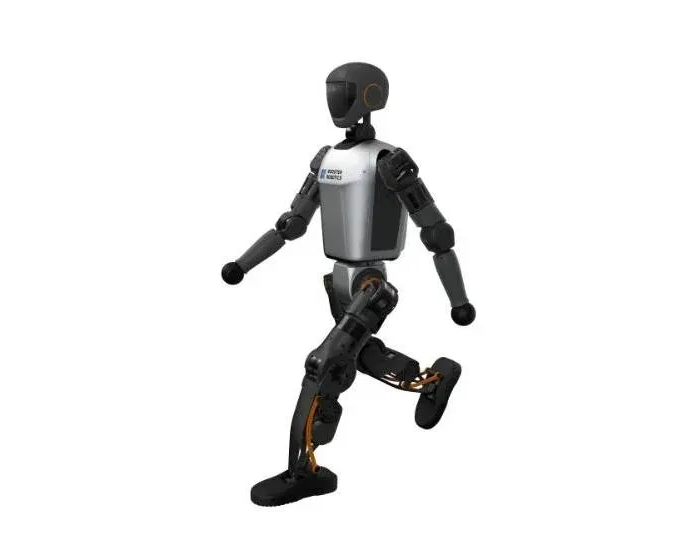

# Asset Zoo

| Robot            | Image                                                                                                         |
|------------------|---------------------------------------------------------------------------------------------------------------|
| **Unitree G1**   |     |
| **Unitree Go1**  |  |
| **i2rt YAM**     |     |
| **Booster T1**   |              |
| **KUKA IIWA 14** |       |
| **Crawler**      |            |
| **Cartpole**     | Classic control toy: a cart on a rail with a free-swinging pole.                                              |
| **Diffdrive**    | Two-wheel differential drive robot.                                                                           |
